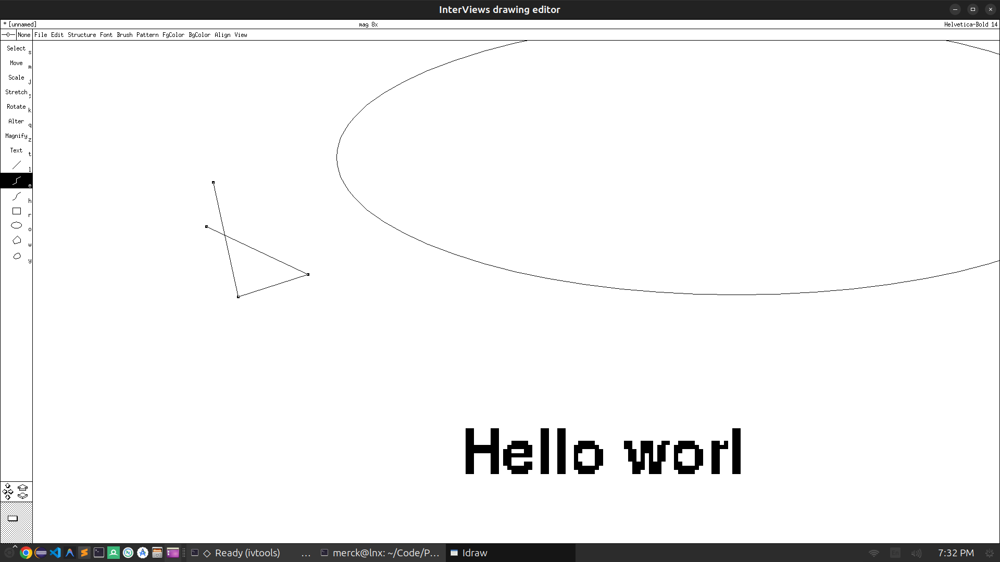
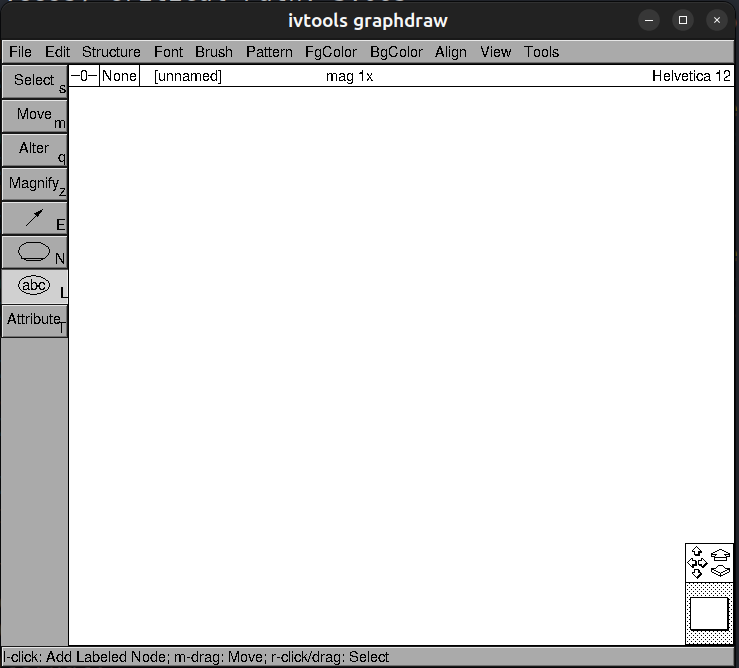
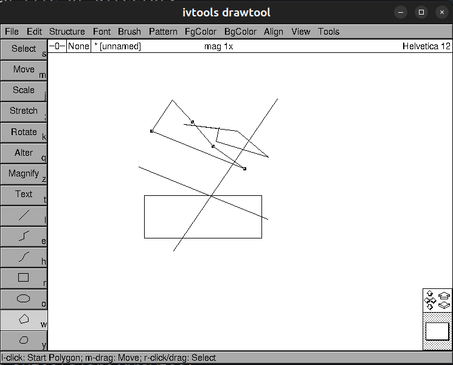

# ivtools - w/ Modernized C++ Build System

This project is a modernization of the legacy `ivtools` C++ framework, originally developed at Stanford and SGI. It replaces the complex legacy `Imake` and `Makefile` system with a streamlined, direct Bazel build.

## Prerequisites

- **Bazel 8.6.0**: [Download and Installation Guide](https://github.com/bazelbuild/bazel/releases/tag/8.6.0)
- **libtiff**: Required for image processing (`sudo apt-get install libtiff-dev`)
- **X11**: Development headers for InterViews graphics (`sudo apt-get install libx11-dev libxext-dev`)

## Quick Start

### Build All Applications

```bash
bazel build //...
```

### Build Specific Applications

```bash
bazel build //:idraw //:comdraw //:graphdraw //:drawtool //:iclass //:comterp
```

### Running Applications

The binaries are located in `bazel-bin/` and can be run directly:
- `bazel-bin/idraw`
- `bazel-bin/comdraw`
- `bazel-bin/graphdraw`
- `bazel-bin/drawtool`
- `bazel-bin/iclass`
- `bazel-bin/comterp`

## Gallery

### InterViews Drawing Editor


### GraphDraw


### Drawtool


## Architecture and Modernization

The codebase has been updated to support modern C++ compilers (like GCC 11+) while maintaining compatibility with the original design. Key modernization steps included:

1. **Direct Bazel Build Configuration**: A comprehensive root `BUILD.bazel` file defines over 20 library targets and multiple binary targets.
2. **C++ Compatibility Fixes**: 
   - Applied `-fpermissive` and `-xc++` flags.
   - Fixed stream scope issues by bridging legacy InterViews iostreams to `std::iostream`.
   - Patched various implicit type conversions and `main` return types.
3. **Dependency Management**: Integrated system-provided `libtiff` and `X11` libraries, removing redundant vendored sources.
4. **InterViews Versioning**: Implemented prioritized include paths to resolve InterViews 2.6 and 3.1 naming conflicts.

## Documentation

Comprehensive documentation is available in the `docs/` directory:
- [ARCHITECTURE.md](docs/ARCHITECTURE.md): Detailed system overview.
- [BUILD_SUMMARY.md](docs/BUILD_SUMMARY.md): Explanation of the Bazel build structure.
- [LIST_OF_CLASSES.md](docs/LIST_OF_CLASSES.md): Reference for core framework classes.
- Technical guides for [idraw](docs/IDRAW.md), [comdraw](docs/COMDRAW.md), [graphdraw](docs/GRAPHDRAW.md), and [drawtool](docs/DRAWTOOL.md).

---
*For more information on the original project, visit [ivtools.org](http://www.ivtools.org).*
