# ivtools - the GUI/Glyph source code "Design Patterns: Elements of Reusable Object-Oriented Software" book talks about

This project is a modernization of the legacy `ivtools` C++ framework, originally developed at Stanford and SGI. It replaces the complex legacy `Imake` and `Makefile` system with a streamlined, direct Bazel build.

## Prerequisites

- **Bazel 8.6.0**: [Download and Installation Guide](https://github.com/bazelbuild/bazel/releases/tag/8.6.0)
- **libtiff**: Required for image processing (`sudo apt-get install libtiff-dev`)
- **X11**: Development headers for InterViews graphics (`sudo apt-get install libx11-dev libxext-dev`)

## Quick Start

### Build All Applications

```bash
bazel build //...
```

### Build Specific Applications

```bash
bazel build //:idraw //:comdraw //:graphdraw //:drawtool //:iclass //:comterp
```

### Running Applications

The binaries are located in `bazel-bin/` and can be run directly:
- `bazel-bin/idraw`
- `bazel-bin/comdraw`
- `bazel-bin/graphdraw`
- `bazel-bin/drawtool`
- `bazel-bin/iclass`
- `bazel-bin/comterp`

## Gallery

### InterViews Drawing Editor
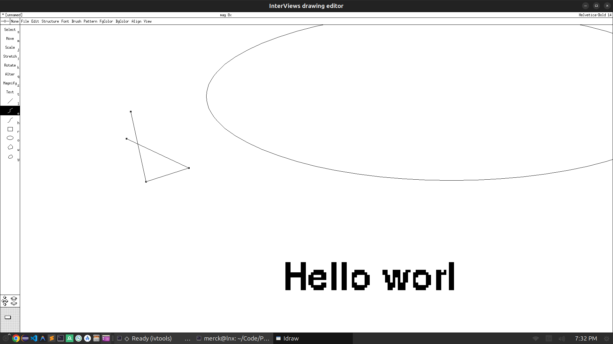

### GraphDraw
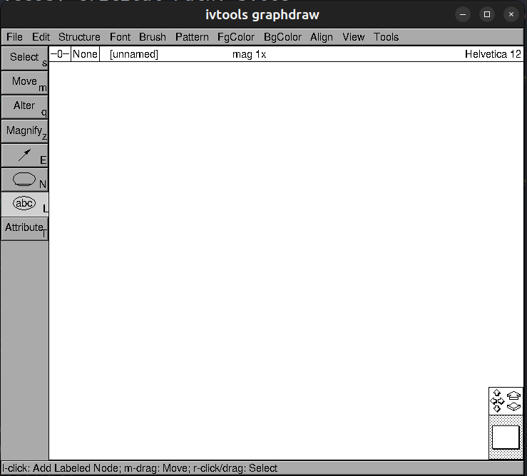

### Drawtool
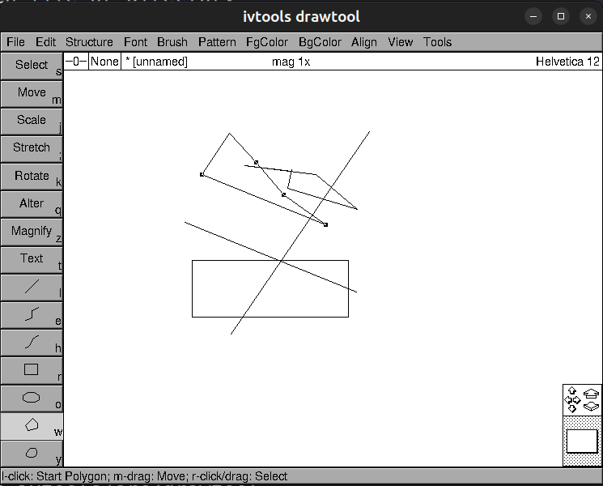

## Architecture and Modernization

The codebase has been updated to support modern C++ compilers (like GCC 11+) while maintaining compatibility with the original design. Key modernization steps included:

1. **Direct Bazel Build Configuration**: A comprehensive root `BUILD.bazel` file defines over 20 library targets and multiple binary targets.
2. **C++ Compatibility Fixes**: 
   - Applied `-fpermissive` and `-xc++` flags.
   - Fixed stream scope issues by bridging legacy InterViews iostreams to `std::iostream`.
   - Patched various implicit type conversions and `main` return types.
3. **Dependency Management**: Integrated system-provided `libtiff` and `X11` libraries, removing redundant vendored sources.
4. **InterViews Versioning**: Implemented prioritized include paths to resolve InterViews 2.6 and 3.1 naming conflicts.

## Documentation

Comprehensive documentation is available in the `docs/` directory:
- [ARCHITECTURE.md](docs/ARCHITECTURE.md): Detailed system overview.
- [BUILD_SUMMARY.md](docs/BUILD_SUMMARY.md): Explanation of the Bazel build structure.
- [LIST_OF_CLASSES.md](docs/LIST_OF_CLASSES.md): Reference for core framework classes.
- Technical guides for [idraw](docs/IDRAW.md), [comdraw](docs/COMDRAW.md), [graphdraw](docs/GRAPHDRAW.md), and [drawtool](docs/DRAWTOOL.md).
- [tools/ivviz](tools/ivviz/README.md): an animated, Skia + Vulkan visualizer of the design (see below).

## Design Visualizer (ivviz)

[`tools/ivviz`](tools/ivviz/README.md) is an animated explanation of how ivtools is designed. It shows which real classes (InterViews glyphs and kits, Unidraw components, views, tools and commands, ComTerp functions) play which design pattern, and how calls and data flow between them, in nine guided tours with call traces taken from the sources. It is written in C++20 with **Skia** (drawing) and **Vulkan** (animated backdrop, compositing, window or headless screenshots), and built with its own **Bazel** module:

```bash
cd tools/ivviz
bazel run //:ivviz            # interactive window: Space pause, ←/→ tour, 1-9 jump
bazel test //tests/...        # tour consistency + every cited file/method exists in ivtools/src
tools/screenshots.sh          # regenerate the screenshots below (headless; Mesa lavapipe works)
```

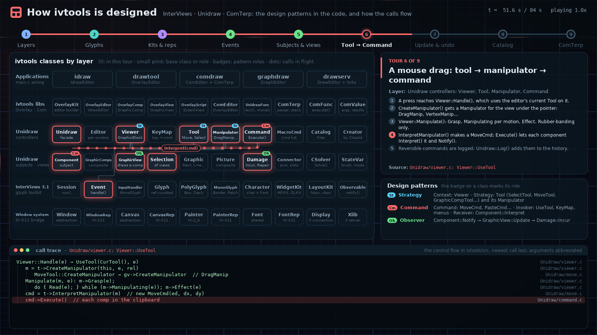

| | | |
|---|---|---|
| 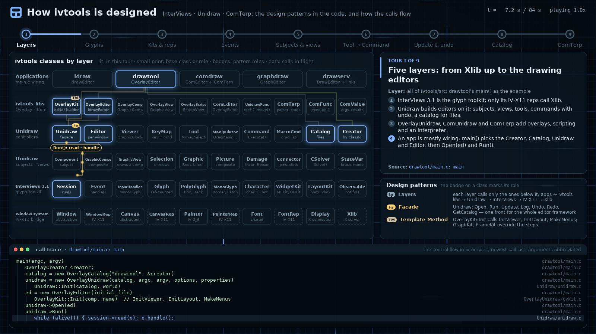<br>1. Layers: Facade, Template Method | 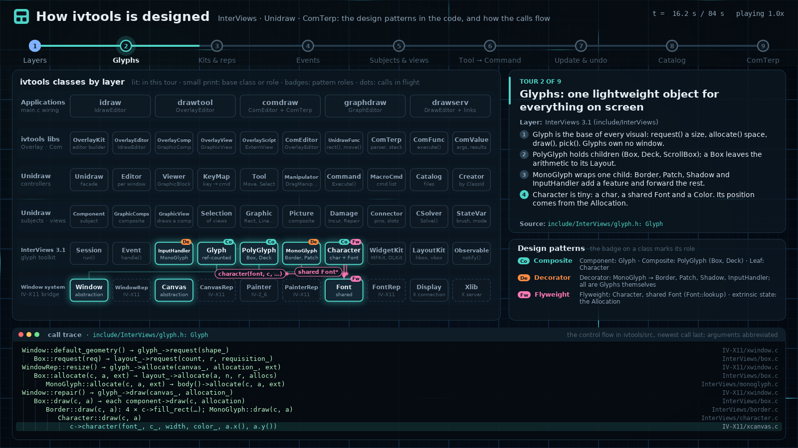<br>2. Glyphs: Composite, Decorator, Flyweight | 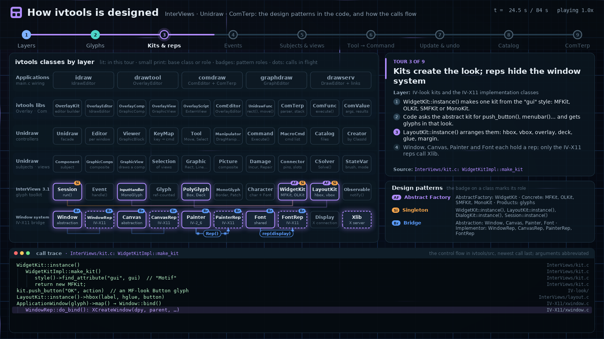<br>3. Kits & reps: Abstract Factory, Singleton, Bridge |
| 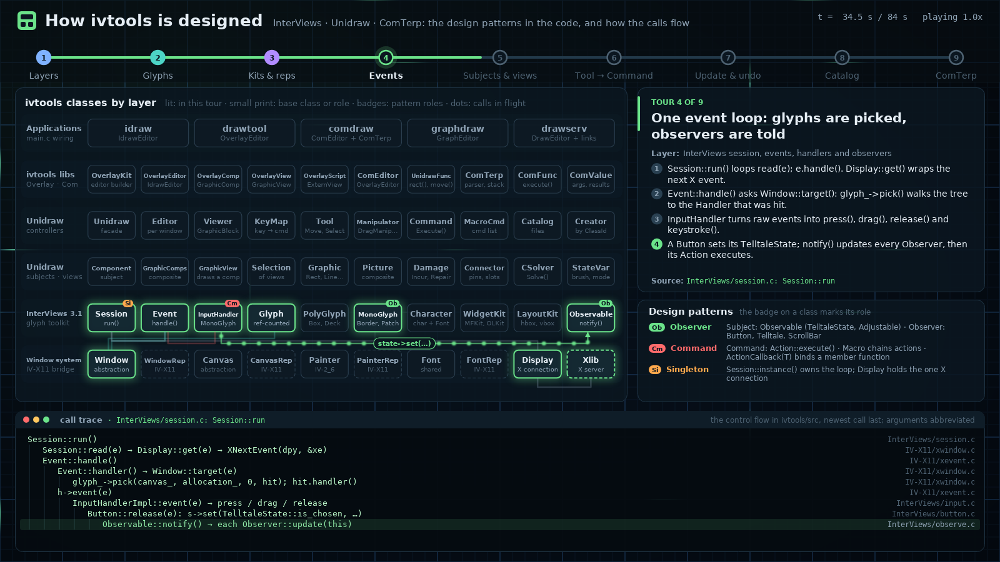<br>4. Events: Observer, Command | 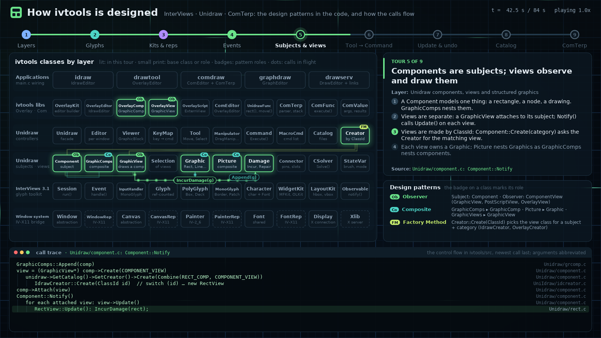<br>5. Subjects & views: Observer, Composite, Factory Method | <br>6. Tool → Command: Strategy, Command, Observer |
| 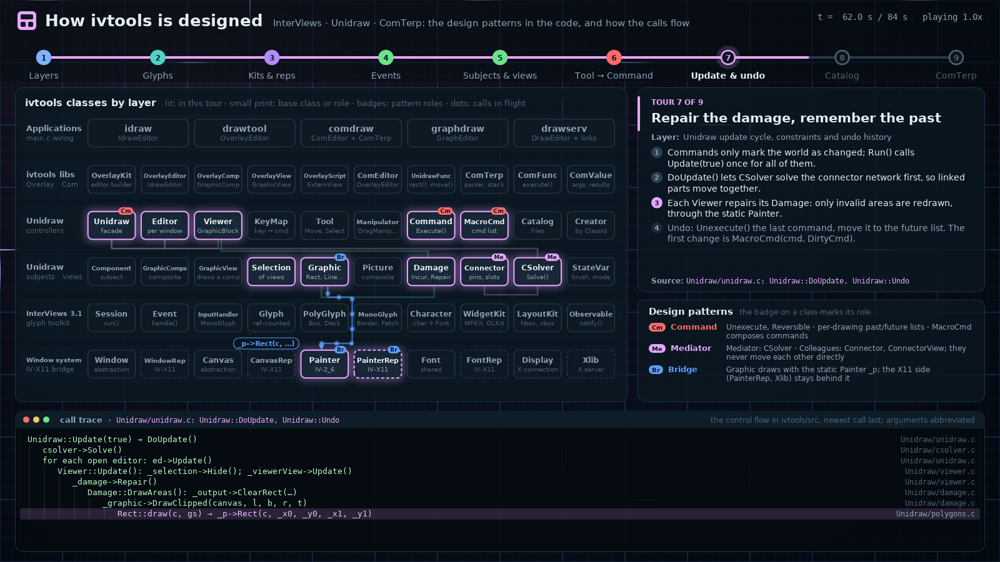<br>7. Update & undo: Command, Mediator, Bridge | 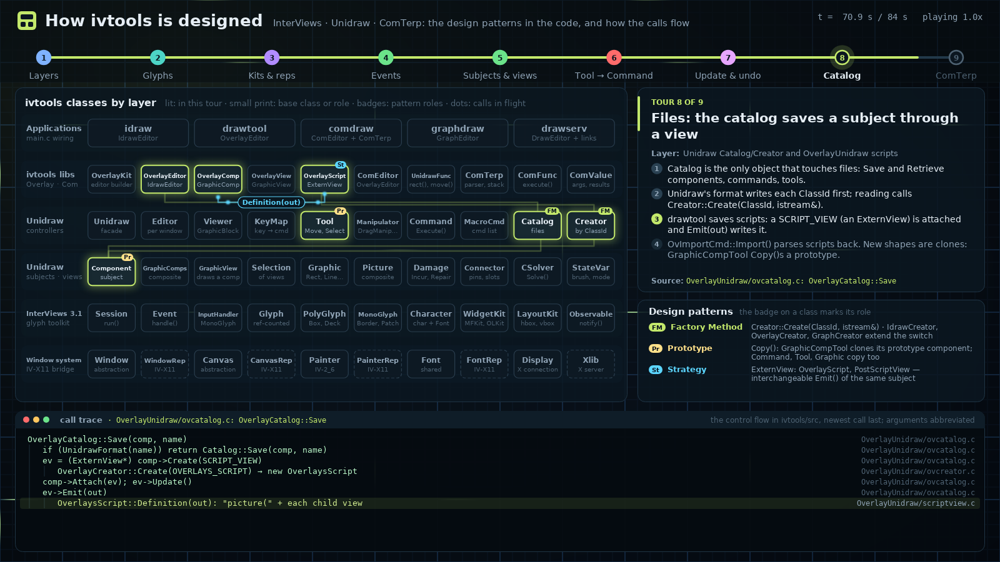<br>8. Catalog: Factory Method, Prototype, Strategy | 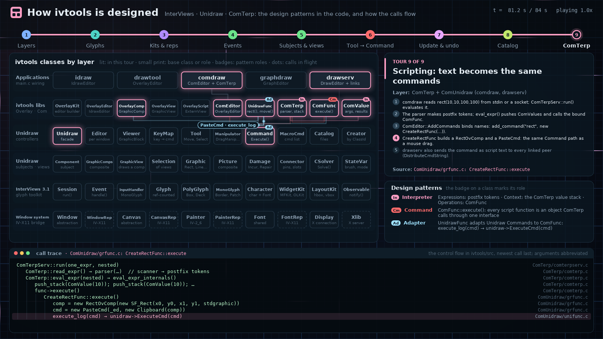<br>9. ComTerp: Interpreter, Command, Adapter |

---
*For more information on the original project, visit [ivtools.org](http://www.ivtools.org).*
