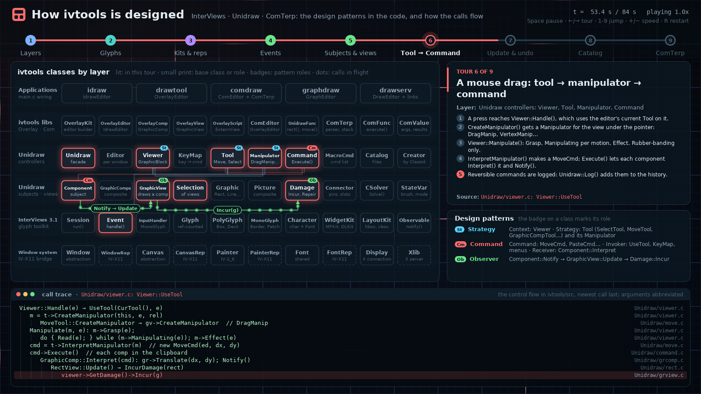

# ivviz: how ivtools is designed

An animated explanation of the design of ivtools. It shows the layers, the
real classes in each one, the design pattern each class plays a role in,
and how calls and data move between them. It plays as nine guided tours.
**Skia** draws the diagram on the CPU. **Vulkan** renders an animated
blueprint backdrop and composites the Skia layer over it. The result goes to
a window, or is read back for screenshots. The program is written in C++20
and built with Bazel (bzlmod). The build layout, the Skia overlay, the
Vulkan plumbing and the application shell follow
[OluxOS's bootviz](https://github.com/merckhung/oluxos/tree/main/tools/bootviz).


| | |
|---|---|
| <br>1. Layers | <br>2. Glyphs |
| <br>3. Kits & reps | <br>4. Events |
| <br>5. Subjects & views | <br>6. Tool → Command |
| <br>7. Update & undo | <br>8. Catalog |
| <br>9. ComTerp | <br>The interactive window (on a virtual X display) |

## What it shows

The diagram has six layer rows. From top to bottom they are the
applications, the ivtools extension libraries (OverlayUnidraw, ComUnidraw,
ComTerp), the Unidraw controllers, the Unidraw subjects and views,
InterViews 3.1, and the window-system bridge. The implementation classes in
the bridge row (`*Rep`, Xlib) have dashed borders. Each tour does four
things:

- It lights up the classes that take part.
- It puts a **badge** on each class for its pattern role, for example `Co`
  for Composite and `Ob` for Observer. The *Design patterns* panel lists
  the roles.
- It animates the **calls and data** between the classes, coloured by the
  pattern they illustrate.
- It plays the matching **call trace** from the sources, indented by
  call-stack depth, with the file each line comes from.

| # | Tour | Patterns | Where in ivtools/src |
|---|------|----------|----------------------|
| 1 | Layers: `main()` wires Creator, Catalog, Unidraw and Editor, then `Run()` | Layers, Facade, Template Method | `drawtool/main.c`, `Unidraw/unidraw.c`, `OverlayUnidraw/ovkit.c` |
| 2 | Glyphs: `request` / `allocate` / `draw` down the glyph tree | Composite, Decorator, Flyweight | `include/InterViews/glyph.h`, `InterViews/box.c`, `border.c`, `character.c` |
| 3 | Kits & reps: widget kits, and the X11 reps behind Window, Canvas, Painter, Font | Abstract Factory, Singleton, Bridge | `InterViews/kit.c`, `IV-X11/xwindow.c`, `xcanvas.c`, `IV-2_6/xpainter.c` |
| 4 | Events: `Session::run`, picking the handler, observers and actions | Observer, Command, Singleton | `InterViews/session.c`, `IV-X11/xevent.c`, `InterViews/button.c`, `observe.c` |
| 5 | Subjects & views: `Component::Notify` → `Update`, views made by ClassId | Observer, Composite, Factory Method | `Unidraw/component.c`, `rect.c`, `grview.c`, `UniIdraw/idcreator.c` |
| 6 | Tool → Command: `Viewer::UseTool`, manipulator, `Execute`, `Log` | Strategy, Command, Observer | `Unidraw/viewer.c`, `move.c`, `command.c`, `grcomp.c` |
| 7 | Update & undo: `DoUpdate`, `CSolver::Solve`, `Damage::Repair`, `Undo` | Command, Mediator, Bridge | `Unidraw/unidraw.c`, `damage.c`, `polygons.c`, `IV-2_6/xpainter.c` |
| 8 | Catalog: saving through a script view, reading through the Creator | Factory Method, Prototype, Strategy | `OverlayUnidraw/ovcatalog.c`, `ovcreator.c`, `scriptview.c`, `Unidraw/catalog.c` |
| 9 | ComTerp: `rect(...)` text becomes a `PasteCmd` on the drag's path | Interpreter, Command, Adapter | `ComTerp/comterp.c`, `ComUnidraw/comeditor.c`, `grfunc.c`, `unifunc.c`, `DrawServ/drawserv.c` |

All the content (classes, patterns, flows, traces) is data in
`src/scene/design_script.cc`. Two tests check it:

- `tests/design_script_test.cc` checks that the tours are consistent. Flows
  must connect lit classes, pattern roles must be on lit classes, and times
  must be ordered.
- `tests/source_refs_test.cc` checks the tours against the real code. Every
  cited file must exist under `ivtools/src`, and every call-trace line must
  name a function that is in its file.

## Build and run

This is a separate Bazel module. The root `.bazelignore` keeps it out of
`bazel build //...` for the ivtools sources.

Prerequisites (Ubuntu/Debian):

```sh
sudo apt install build-essential libvulkan1 mesa-vulkan-drivers libglfw3-dev \
                 glslang-tools fonts-dejavu-core git
# Bazel: bazelisk; .bazelversion pins Bazel 8.6.0
```

```sh
cd tools/ivviz
bazel run //:ivviz                                   # window, 1600x900
bazel run //:ivviz -- --speed=2 --stage=6            # start at tour 6, twice as fast
bazel run //:ivviz -- --screenshot=$PWD/t.png --stage=7 --progress=0.7
tools/screenshots.sh                                 # regenerate docs/screenshots
bazel test //tests/...
```

The first build fetches Skia at a pinned commit and compiles about 600 of
its sources, which takes a few minutes.

| Key | Action |
|-----|--------|
| Space | Pause or resume |
| ← / → | Previous or next tour |
| 1–9 | Jump to a tour |
| + / − | Double or halve the speed |
| R, Home | Restart |
| Esc, Q | Quit |

`--headless` renders offscreen with no display. `--screenshot` and
`--screenshots` turn it on. Mesa's lavapipe software Vulkan driver is
enough; the screenshots here were made with it. `--help` lists every flag.

### Restricted networks

Some networks allow `git clone` from GitHub but block other downloads. The
blocked ones can include archive downloads (`github.com/.../archive/...`),
the savannah mirrors, or `bcr.bazel.build` itself. On such a network, run

```sh
tools/git_modules.py
echo 'common --registry=https://raw.githubusercontent.com/bazelbuild/bazel-central-registry/main' >> user.bazelrc
```

once. The script clones vulkan_headers, stb, freetype and libpng at their
Bazel Central Registry tags. It applies the registry's patches and overlays
after checking their SHA-256, then writes `--override_module` lines to
`user.bazelrc`. That file is untracked and imported by `.bazelrc`. The
second line reads the registry from its GitHub mirror.

## Layout

```
MODULE.bazel         bzlmod deps (rules_cc, vulkan_headers, stb, freetype from the BCR);
                     Skia via git_repository + our BUILD overlay; host GLFW and GLSL compiler
bazel/               shader_tools.bzl, shaders.bzl (GLSL -> SPIR-V -> embedded C++),
                     system_libs.bzl (host GLFW)
third_party/skia/    skia.BUILD overlay + generated source lists (CPU raster, FreeType fonts)
src/scene/           design_script.* (the tours: classes, patterns, flows, call traces),
                     scene.* (Skia drawing, grid layout and flow routing), text.* (fonts)
src/render/          dlopen Vulkan loader, device/swapchain/offscreen context, compositor
                     (blueprint backdrop shader + Skia overlay), GLSL shaders
src/app/             window loop, keyboard, headless screenshots, flags
tests/               tour consistency, source references, Skia raster rendering of every tour
tools/               screenshots.sh, git_modules.py, gen_skia_srcs.py, embed (SPIR-V -> C++)
```

- **Rendering.** Each frame, Skia draws the scene into a CPU buffer. It is
  designed at 1600×900 and scaled uniformly to the window.
  - The buffer is uploaded as a texture and blended over the backdrop with
    premultiplied alpha. A fragment shader draws the backdrop.
  - Pulses on the backdrop's grid lines take the current tour's colour.
- **Routing.** Classes sit on a ten-column grid. A flow leaves its class
  into the channel between two rows. When it has to cross several rows, it
  runs down the gap between two columns, so it never crosses a class.
  Labels sit in the channels and move aside for other labels and badges.

## Licence

The files adapted from bootviz and twn_election keep the Apache-2.0 licence
(`LICENSE.twn_election`). `NOTICE` lists them, and each one says so in its
header. Skia is BSD-3-Clause. The ivtools sources that this tool describes
carry their own licences (see `ivtools/COPYRIGHT`).
